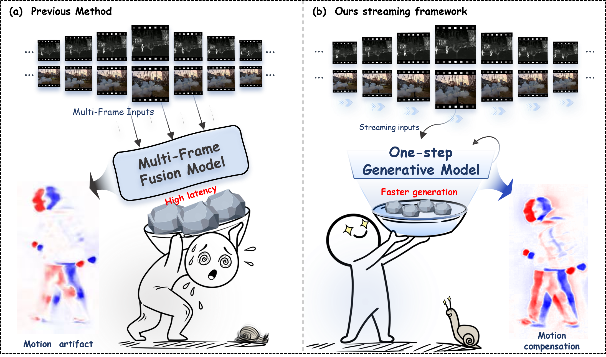
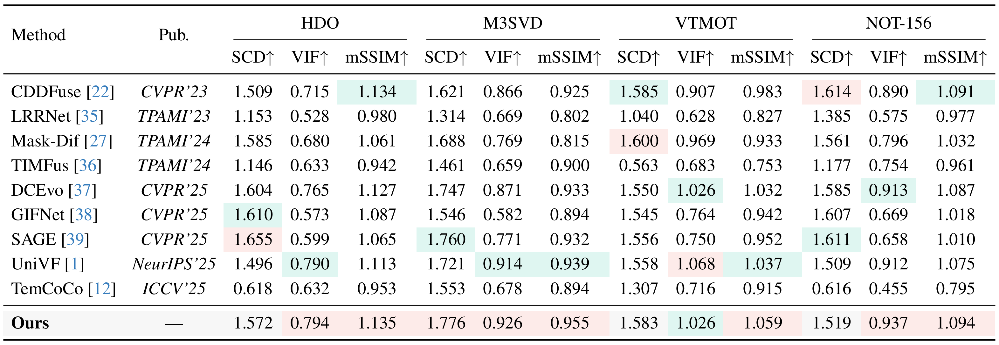
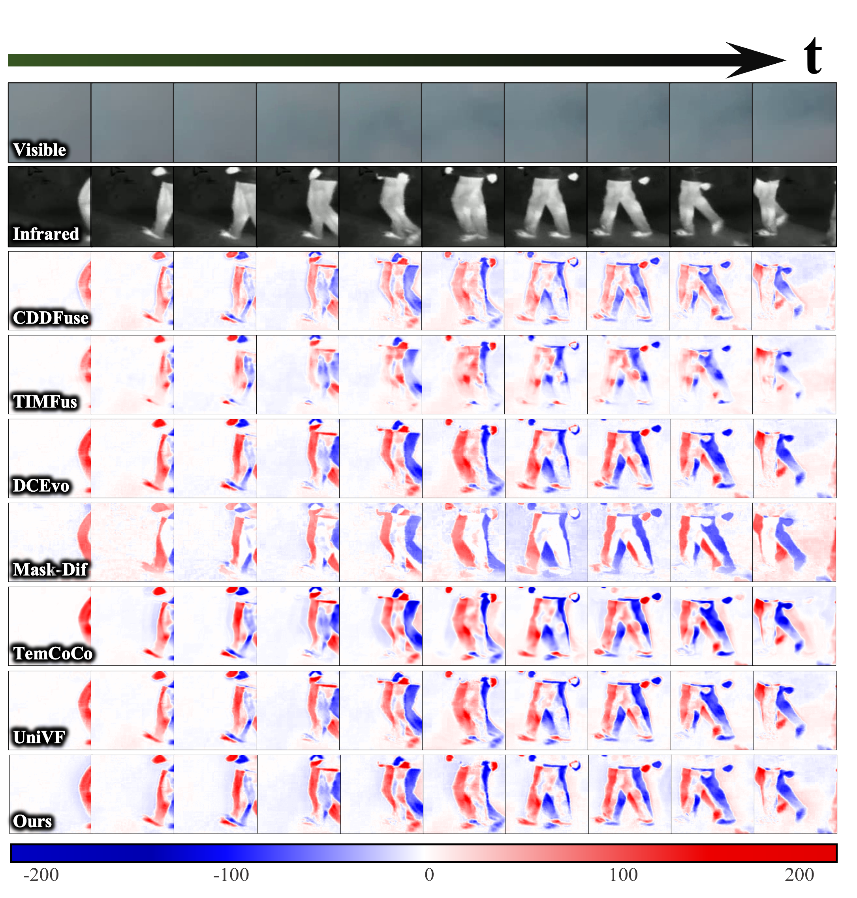

# SDMFusion 

Jinyuan Liu, Ludan Sun, Tengyu Ma, Chunyan Yang, Zhiying Jiang, Long Ma, Risheng Liu, Xin Fan, **"Streaming Diffusion Model for Fast Infrared and Visible Video Fusion"**, IEEE/CVF Conference on Computer Vision and Pattern Recognition **(CVPR)**, 2026.



## News

- Training and testing code are provided for infrared and visible video fusion.
- The image fusion version will be released in a future update.

## Environment

```bash
conda create -n sdmfusion python=3.9 -y && conda activate sdmfusion
pip install torch==2.8.0 torchvision==0.23.0 torchaudio==2.8.0 --index-url https://download.pytorch.org/whl/cu128
pip install diffusers safetensors transformers accelerate kornia timm einops natsort tqdm pillow opencv-python numpy thop
```

## Pretrained Weights Preparation

Download the SD-Turbo pretrained weights from the official Hugging Face repository: https://huggingface.co/stabilityai/sd-turbo. Only the following SD-Turbo files are required:

```text
pretrained/sd-turbo/
|-- scheduler/
|   `-- scheduler_config.json
`-- unet/
    |-- config.json
    `-- diffusion_pytorch_model.safetensors
```

The released project checkpoint and SpyNet weight are provided in `outputs/stage2.pt` and `pretrained/spynet.pth`, respectively.

## Datasets Preparation

We provide a demo dataset in `test_data/` for quick testing. The demo includes M3SVD and NOT-156 video sequences, with four sequences and eight consecutive frames per sequence.

Please organize each dataset in the following paired video format:

```text
dataset_name/
`-- video_name/
    |-- visible/ or channel/      # visible frames
    `-- infrared/ or channel2/    # infrared frames
```
For example, M3SVD uses `visible/infrared`, while NOT-156 uses `channel/channel2`.

## Testing

Run streaming inference:

```bash
CUDA_VISIBLE_DEVICES=0 python test_video.py --dataset m3svd --data_root test_data --ckpt_path outputs/stage2.pt
```

For the NOT-156 demo:

```bash
CUDA_VISIBLE_DEVICES=0 python test_video.py --dataset not156 --data_root test_data --ckpt_path outputs/stage2.pt
```

The results are saved to:

```text
results/<dataset>/
|-- test_log.json
`-- <dataset>/
```

## Training

Train Stage I and Stage II with one Linux command:

```bash
CUDA_VISIBLE_DEVICES=0 python train_video.py --train_root NOT156_train
```

## Results

### Qualitative Comparison

Qualitative comparisons with state-of-the-art fusion approaches on the HDO, VTMOT, NOT-156, and M3SVD datasets.


### Quantitative Comparison

Quantitative comparison with state-of-the-art fusion approaches on the HDO, VTMOT, NOT-156, and M3SVD datasets. Red highlights the best performance, while green denotes the second-best results.



### Temporal Consistency

Frame-wise difference visualization on the M3SVD dataset for temporal consistency evaluation.



## Citation

```bibtex
@InProceedings{Liu_2026_CVPR,
    author    = {Liu, Jinyuan and Sun, Ludan and Ma, Tengyu and Yang, Chunyan and Jiang, Zhiying and Ma, Long and Liu, Risheng and Fan, Xin},
    title     = {Streaming Diffusion Model for Fast Infrared and Visible Video Fusion},
    booktitle = {Proceedings of the IEEE/CVF Conference on Computer Vision and Pattern Recognition (CVPR)},
    month     = {June},
    year      = {2026},
    pages     = {14305-14314}
}
```
